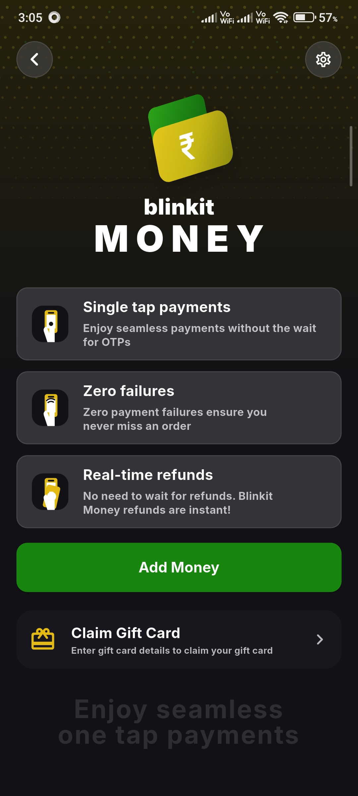

# flicktv-sumit

Flutter UI/UX animation assignment for Flick TV.

## APK

[Download the signed APK](media/flicktv-sumit-release.apk?raw=true)

## Preview

## Screen Recording

<video src="media/flicktv-sumit-rec.mp4" controls width="360"></video>

[Open the screen recording](media/flicktv-sumit-rec.mp4)

## Details

- Package name: `flicktv.sumit`
- App name: `Sumit Rai`
- Third-party runtime packages: none
- Orientation: portrait only

## What is included

- Blinkit Money inspired animated intro screen
- Custom sticker celebration animation
- Responsive layout for mobile and tablet portrait sizes
- Structured Flutter code with separated constants, localization, widgets, animations, painters, and view model
